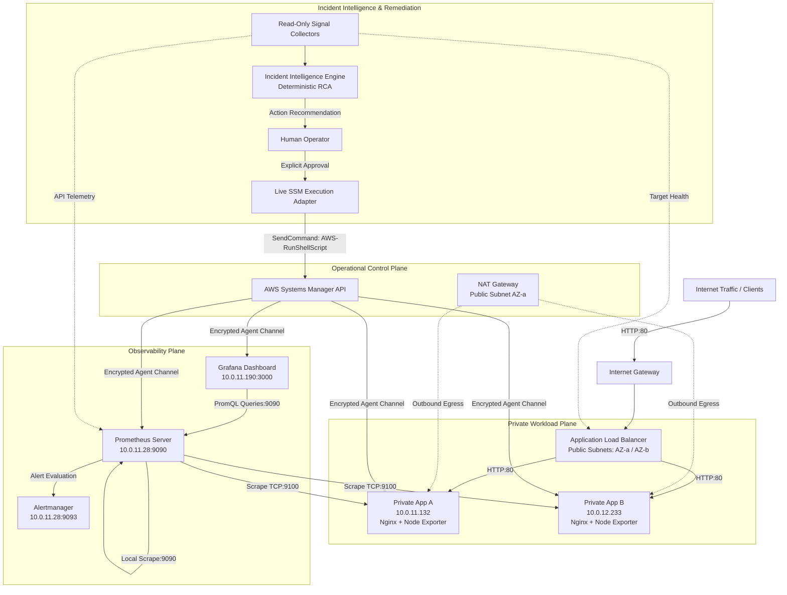

# Platform Architecture

An enterprise-grade, multi-tier, multi-Availability Zone (AZ) reliability and observability architecture provisioned on AWS using Terraform.

---

## 1. Architectural Overview

The platform provides high availability, fault isolation, strict security group tiering, and metrics-driven operational observability across public and private subnets in AWS `eu-west-1`.

---

## 2. Core Architectural Design Decisions

### A. Private Workload Tiering
- **Design:** Application workloads (`app_a` and `app_b`) and observability components (`prometheus` and `grafana`) are placed entirely within private subnets without public IPv4 addresses.
- **Rationale:** Direct inbound access from the public internet is eliminated at the network level. Ingress to application servers is strictly mediated by the Application Load Balancer.

### B. Ingress Mediation via Application Load Balancer (ALB)
- **Design:** The ALB spans public subnets across `eu-west-1a` and `eu-west-1b`, exposing an internet-facing endpoint and distributing traffic to target instances via health-checked target groups.
- **Rationale:** Provides high availability across AZs, TLS termination readiness, Layer 7 routing, and dynamic health check validation that decouples frontend client traffic from backend node failures.

### C. NAT Gateway for Secure Outbound Connectivity
- **Design:** A single NAT Gateway situated in public subnet `eu-west-1a` handles outbound internet egress for private workloads via the private route table.
- **Rationale:** Enables private EC2 instances to download OS packages, vendor software releases, and communicate with AWS service endpoints (like SSM) without exposing inbound listening ports to the internet.

### D. Zero-SSH Operational Access via AWS Systems Manager (SSM)
- **Design:** No bastion hosts, public jump boxes, or inbound SSH ports (`TCP:22`) are open in any security group. All administrative and operational interactions use AWS Systems Manager Run Command / Session Manager.
- **Rationale:** Eliminates static SSH key management, perimeter brute-force risk, and credential leakage while providing complete AWS CloudTrail auditability of all administrative commands.

### E. Restrictive Security Group Referencing
- **Design:** Ingress rules use Security Group IDs as source references rather than CIDR blocks:
  - App Security Group accepts `TCP:80` strictly from the ALB Security Group.
  - App Security Group accepts `TCP:9100` strictly from the Monitoring Security Group.
  - Prometheus Security Group accepts `TCP:9090` strictly from the Grafana Security Group and localhost.
- **Rationale:** Enforces least-privilege transport boundaries that automatically scale with instance membership without hardcoding IP addresses.

### F. Separation of RCA and Remediation
- **Design:** The Incident Intelligence engine is completely read-only and side-effect-free. It produces structured recommendations that require an explicit, out-of-band human approval gate before the SSM remediation adapter can be invoked.
- **Rationale:** Prevents autonomous runaway loops, catastrophic unintended restarts, and unauthorized privilege escalation during ambiguous incidents.

---

## 3. Network Topology & Subnet Allocation

| Subnet | Type | AZ | CIDR Block | Hosted Workloads |
|---|---|---|---|---|
| `public_a` | Public | `eu-west-1a` | `10.0.1.0/24` | ALB Listener, NAT Gateway, Bastionless Ingress |
| `public_b` | Public | `eu-west-1b` | `10.0.2.0/24` | ALB Listener (Multi-AZ Failover) |
| `private_a` | Private | `eu-west-1a` | `10.0.11.0/24` | App Server A (`10.0.11.132`), Prometheus (`10.0.11.28`), Grafana (`10.0.11.190`) |
| `private_b` | Private | `eu-west-1b` | `10.0.12.0/24` | App Server B (`10.0.12.233`) |

---

## 4. Observability & Telemetry Plane

### Prometheus Server (`10.0.11.28`)
- Scrapes metrics from `node_exporter` endpoints (`10.0.11.132:9100`, `10.0.12.233:9100`) and itself (`10.0.11.28:9090`) every 15 seconds.
- Evaluates multi-window multi-burn-rate recording rules and alert expressions continuously.

### Grafana Dashboard (`10.0.11.190`)
- Visualizes golden signals, SLO error budget remaining, burn rate velocities, and system resource consumption across all compute instances.

### Alertmanager (`10.0.11.28:9093`)
- Deduplicates, groups, and routes active firing alerts generated by Prometheus.
