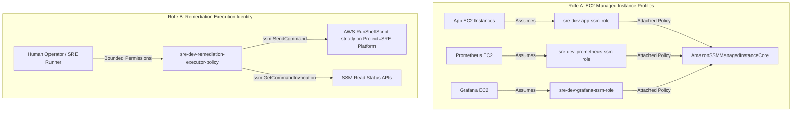

# Security & Access Control Model

An enterprise security architecture designed around defense-in-depth, zero-trust network boundaries, immutable least-privilege IAM policies, and fail-closed operational remediation controls.

---

## 1. IAM Architecture & Role Separation

The platform enforces a strict separation between machine roles (instances) and operator identities (remediation orchestration).



### A. Role A: EC2 Instance Profiles (`AmazonSSMManagedInstanceCore`)
- **Purpose:** Allows the instance-level AWS Systems Manager Agent (`amazon-ssm-agent`) to register with the Systems Manager service, poll for assigned documents, and stream encrypted execution status back to AWS.
- **Scope:** Assigned to `sre-dev-app-a`, `sre-dev-app-b`, `sre-dev-prometheus`, and `sre-dev-grafana`.
- **Guarantees:** Instances cannot invoke SSM commands on other instances; they only execute commands explicitly assigned to them by an authorized caller.

### B. Role B: Remediation Execution Identity (`sre-dev-remediation-executor-policy`)
- **Purpose:** Grants the SRE remediation orchestrator the exact, bounded permissions required to execute allowlisted commands and read command statuses.
- **Policy Definition (Implemented in [iam.tf](../../iam.tf)):**
  ```json
  {
    "Version": "2012-10-17",
    "Statement": [
      {
        "Sid": "SSMSendCommandRestricted",
        "Effect": "Allow",
        "Action": ["ssm:SendCommand"],
        "Resource": [
          "arn:aws:ssm:eu-west-1:*:document/AWS-RunShellScript",
          "arn:aws:ec2:eu-west-1:*:instance/*"
        ],
        "Condition": {
          "StringEquals": {
            "aws:ResourceTag/Project": "SRE Platform"
          }
        }
      },
      {
        "Sid": "SSMCommandInvocationRead",
        "Effect": "Allow",
        "Action": [
          "ssm:GetCommandInvocation",
          "ssm:ListCommands",
          "ssm:DescribeInstanceInformation"
        ],
        "Resource": "*"
      },
      {
        "Sid": "EC2TargetDiscoveryRead",
        "Effect": "Allow",
        "Action": ["ec2:DescribeInstances"],
        "Resource": "*"
      }
    ]
  }
  ```
- **Deployment Status Note:** The dedicated remediation IAM policy is defined and validated in Terraform. In accordance with strict development drill boundaries, it was intentionally NOT applied to live AWS during Phase 8B finalization; the controlled drill was conducted using the verified lab execution identity. Production deployment should bind this dedicated role to automated runners.

---

## 2. Network Security & Perimeter Hardening

### Zero Inbound SSH (`Port 22`)
- No Security Group in the entire platform permits inbound `TCP:22`.
- Direct perimeter penetration via brute force or compromised SSH private keys is eliminated.
- All command-line interactions are tunneled via AWS Systems Manager over TLS.

### Security Group Ingress Matrix

| Security Group | Ingress Port | Permitted Source | Enforcement Rationale |
|---|---|---|---|
| `sre-dev-alb-sg` | `TCP:80` | `0.0.0.0/0` (Internet) | Public entry point for application web traffic |
| `sre-dev-app-sg` | `TCP:80` | `sre-dev-alb-sg` (SG Reference) | Only the ALB can forward web requests to app nodes |
| `sre-dev-app-sg` | `TCP:9100` | `sre-dev-monitoring-sg` (SG Reference) | Only Prometheus can scrape `node_exporter` metrics |
| `sre-dev-prometheus-sg` | `TCP:9090` | `sre-dev-grafana-sg` (SG Reference) | Only Grafana can query Prometheus API metrics |
| `sre-dev-grafana-sg` | `TCP:3000` | Localhost / Private Subnet | Dashboards isolated to private operations plane |

---

## 3. Remediation Safety Model & Fail-Closed Guardrails

The live remediation adapter (`incident_intelligence/execution.py`) enforces strict runtime constraints:

```text
[Incoming Remediation Request]
               │
               ▼
   [Is Action in ALLOWED_ACTIONS?] ─── No ───▶ [BLOCK Execution]
               │ Yes
               ▼
   [Is Root Cause monitoring_agent_failure?] ─── No ───▶ [BLOCK Execution]
               │ Yes
               ▼
   [Is Target Instance Explicit & Matched?] ─── No ───▶ [BLOCK Execution]
               │ Yes
               ▼
   [Is Human Approval Approved=True?] ─── No ───▶ [BLOCK Execution]
               │ Yes
               ▼
   [Execute Fixed Internal Command Payload via SSM]
               │
               ▼
   [8-Point Recovery Telemetry Verification] ─── Fail ───▶ [DO NOT CLOSE / Escalate]
               │ Pass
               ▼
   [Close Incident]
```

### Safety Rules Enforced in Code:
1. **Single Allowlisted Action:** The system strictly allows `restart_node_exporter`. All other actions are rejected.
2. **Fixed Command Payload:** The command string is hardcoded internally to:
   ```bash
   systemctl restart node_exporter
   systemctl is-active --quiet node_exporter
   ```
   No user-supplied command strings or dynamic shell arguments can be injected.
3. **Target Validation:** Requires an explicit EC2 instance ID (`i-...`) matching the incident's affected resource.
4. **No Autonomous Execution:** Execution is impossible without explicit approval metadata (`approved=True`, `approver`, `approval_reason`).
5. **No Blind Retries:** If an SSM command fails or times out, the system fails closed and escalates to a human.
6. **Multi-Signal Verification Before Closure:** Closure requires 5 distinct health signals (exporter active, Prometheus UP, alerts cleared, ALB target healthy, ALB HTTP 200).
