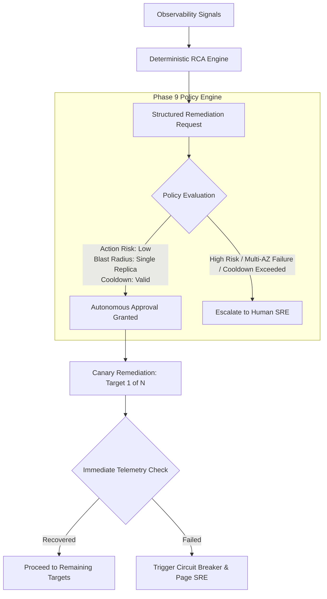

# Phase 9: Policy-Controlled Autonomous SRE (Planned Evolution)

> **Important Architectural Notice:**
> *Phase 9 represents the planned future roadmap for the AWS SRE Platform and is **NOT YET IMPLEMENTED**. The current platform operating state is strictly Phase 8B (Human-Approved Remediation).*

---

## 1. Vision & Evolution

Phase 9 will introduce machine-evaluated policy controls, safety guardrails, rate limiters, and canary remediation to enable autonomous self-healing for strictly low-risk, deterministic failure modes.

---

## 2. Planned Safety & Governance Policies

Autonomous execution in Phase 9 will be governed by six mandatory policy dimensions:

1. **Risk Scoring & Action Allowlisting:** Actions are assigned risk levels. Only Tier-0 actions (`restart_node_exporter`) will be eligible for autonomous approval. Tier-1+ actions (e.g., Nginx restart, target draining, instance replacement) will continue to require human authorization.
2. **Blast Radius Limits:** Autonomous remediation will be restricted to a maximum of **1 instance per Availability Zone** at any given time.
3. **Cooldown & Flapping Protection:** A mandatory 15-minute cooldown window per instance prevents thrashing and repeated restarts on flapping services.
4. **Circuit Breakers & Quotas:** If autonomous remediation fails on 2 consecutive attempts across the fleet within 1 hour, the policy engine trips the circuit breaker, freezes all automated actions, and issues a critical page to the on-call engineer.
5. **Canary Verification Gates:** Multi-instance remediation will execute strictly as a canary (remediate 1 node $\to$ verify recovery signals $\to$ proceed to next).
6. **Immutable Audit Logging:** Every autonomous decision, policy evaluation trace, and SSM execution record will be published to AWS CloudWatch Logs and S3 for compliance auditing.

---

## 3. Implementation Prerequisites for Phase 9
Before Phase 9 can be activated:
- Complete OpenTelemetry and distributed tracing integration (Phase 6).
- AWS Service Discovery and dynamic Prometheus target management (Phase 7).
- Formal policy engine integration (e.g., Open Policy Agent / Rego rules).
- Automated CI/CD pipelines with comprehensive chaos testing.
